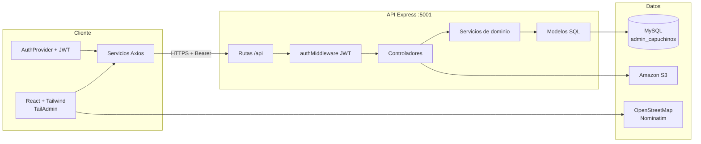

# AdminCapuchinos

Sistema de administración para la gestión de la comunidad capuchina: hermanos, fraternidades, grupos, comunicaciones, tareas, calendario litúrgico/operativo y contenido (noticias y santos).

Arquitectura **cliente–servidor** en TypeScript: panel web (React) y API REST (Node.js / Express) sobre MySQL, con almacenamiento de archivos en Amazon S3.

---

## Características

| Módulo | Descripción |
| --- | --- |
| **Autenticación y perfil** | Login con JWT, perfil vinculado al hermano, cambio de contraseña y foto. |
| **Control de acceso (RBAC)** | Tres roles: Administrador, Usuario estándar y Comunicaciones. El menú y las rutas se filtran por `type_user`. |
| **Hermanos** | Directorio de hermanos (datos personales, profesión, servicios, imagen). |
| **Usuarios** | Cuentas de acceso asociadas a hermanos y tipos de usuario. |
| **Fraternidades (homes)** | Casas/fraternidades con guardian, párroco, usuario de comunicaciones, historia, ubicación en mapa y galería. |
| **Grupos** | Grupos por tipo, asignación de miembros, líder de grupo, icono y galería. |
| **Noticias** | Contenido con editor enriquecido, imagen de portada, alcance (general / fraternidad / grupo) y slugs SEO únicos. |
| **Santos y beatos** | Fichas con fechas, tipo (santo/beato), imagen y adjuntos del editor. |
| **Tareas e informes** | Creación, asignación, recurrencia, envío de reportes, revisión (aprobar/rechazar) y vistas según rol (gestión vs. informes de comunicaciones). |
| **Calendarios y eventos** | Calendarios asignables (todos / fraternidad / grupo / hermano), eventos, recurrencia, excepciones y recordatorios. |
| **Notificaciones** | Listado, conteo de no leídas y marcado de lectura (tareas y recordatorios de eventos). |
| **Adjuntos** | Subida de imágenes desde el editor WYSIWYG (noticias, santos, tareas). |

---

## Arquitectura del sistema

El backend sigue una **arquitectura en capas** (layered / MVC ligero). El frontend es una SPA con servicios HTTP, contexto de autenticación y guardas de ruta.



### Capas del backend (`backend/src`)

| Capa | Responsabilidad |
| --- | --- |
| `routes/` | Definición de endpoints REST. |
| `middleware/` | JWT (`authMiddleware`) y carga de archivos (`multer`). |
| `controllers/` | Validación de petición/respuesta HTTP. |
| `services/` | Reglas de negocio (tareas, eventos, recordatorios, S3). |
| `models/` | Acceso a datos con SQL parametrizado (`mysql2`). |
| `config/` | Pool MySQL, variables de entorno. |
| `migrations/` | Scripts SQL de evolución de esquema (calendario, santos, slugs). |

### Capas del frontend (`frontend/src`)

| Capa | Responsabilidad |
| --- | --- |
| `pages/` | Pantallas de negocio (Hermanos, Fraternidades, Grupos, etc.). |
| `components/` | UI reutilizable y módulos (tareas, calendario, noticias). |
| `services/` | Cliente HTTP por dominio (Axios + token en `localStorage`). |
| `config/permissions.ts` | Fuente única de roles y acceso a rutas. |
| `layout/` | Shell del panel (sidebar filtrado por permisos). |

### Autenticación y autorización

1. `POST /api/auth/login` valida credenciales (`bcrypt`) y emite un **JWT**.
2. El cliente envía `Authorization: Bearer <token>` en cada petición.
3. Las rutas de negocio están protegidas con `authMiddleware`.
4. En el cliente, `ProtectedRoute` exige sesión y `RoutePermissionGuard` aplica el rol.

**Roles** (`type_user`):

| ID | Rol | Acceso típico |
| --- | --- | --- |
| 1 | Administrador | Todos los módulos. |
| 2 | Usuario estándar | Inicio, calendario, tareas, perfil. |
| 3 | Comunicaciones | Fraternidades (alcance), noticias, santos, calendario, tareas/informes. |

### Datos y archivos

- **MySQL** mediante pool de conexiones (`mysql2/promise`). Base por defecto: `admin_capuchinos`.
- **Amazon S3** para imágenes: perfiles, fraternidades, grupos, noticias, santos y tareas.
- **Migraciones SQL** en `backend/migrations/` (calendarios/eventos, santos, slugs de noticias).
- Prisma está declarado en el backend; el acceso operativo actual es **SQL directo** a MySQL, no el schema Prisma.

### Procesos en segundo plano

Cada 5 minutos el servidor ejecuta `EventReminderService.processDueReminders()`: expande eventos recurrentes, resuelve destinatarios según la asignación del calendario y genera notificaciones.

---

## Stack tecnológico

### Frontend

- React 19, TypeScript, Vite 6
- Tailwind CSS 4 (plantilla **TailAdmin**)
- React Router 7
- Axios
- FullCalendar / Toast UI Calendar
- Froala Editor (contenido enriquecido)
- Leaflet + OpenStreetMap (ubicación de fraternidades)
- SweetAlert2, ApexCharts, Swiper

### Backend

- Node.js, Express 4, TypeScript
- `mysql2` (pool de conexiones)
- `jsonwebtoken` + `bcrypt`
- Multer (multipart)
- AWS SDK v3 (`@aws-sdk/client-s3`)
- `rrule` / utilidades de recurrencia para calendarios y tareas

---

## APIs e integraciones

### API REST propia

Base local: `http://localhost:5001/api`  
Prefijo de negocio: rutas bajo `/api/*` protegidas con JWT, excepto autenticación y health.

| Prefijo | Recurso |
| --- | --- |
| `POST /api/auth/login` | Inicio de sesión (público) |
| `GET\|PUT /api/auth/profile` | Perfil |
| `PUT /api/auth/change-password` | Contraseña |
| `GET /api/health` | Estado del servicio |
| `GET /api/db-status` | Conectividad MySQL |
| `/api/brother` | Hermanos y búsquedas por rol |
| `/api/user` | Usuarios y tipos de usuario |
| `/api/home` | Fraternidades y galería |
| `/api/group` | Grupos, miembros e imágenes |
| `/api/typegroup` | Catálogo de tipos de grupo |
| `/api/newspaper` | Noticias |
| `/api/saints` | Santos y beatos |
| `/api/tasks` | Tareas, reportes y revisión |
| `/api/calendars` | Calendarios y asignaciones |
| `/api/events` | Eventos y excepciones |
| `/api/notifications` | Notificaciones in-app |
| `/api/attachments` | Imágenes del editor (noticias, santos, tareas) |

Detalle de operaciones (métodos principales):

```
Auth          POST   /auth/login
              GET    /auth/profile
              PUT    /auth/profile
              PUT    /auth/change-password

Hermanos      GET    /brother
              GET    /brother/:id
              POST   /brother
              PUT    /brother/:id
              DELETE /brother/:id
              GET    /brother/findBrothersForGuardian
              GET    /brother/findBrothersForParishPriest
              GET    /brother/findBrothersForCommunicationUser
              GET    /brother/usersInCommsScope
              GET    /brother/standardUsersInGroup
              GET    /brother/membersInLedGroups
              GET    /brother/getListTypeUserServices

Usuarios      GET    /user/getAllUser
              GET    /user/searchListTypeUsers
              POST   /user/create
              PUT    /user/update/:id

Fraternidades POST   /home
              GET    /home
              GET    /home/:id
              PUT    /home/:id
              DELETE /home/:id
              GET    /home/forCommunicationUser
              POST   /home/createImgHome
              GET    /home/getAllImgById/:id
              DELETE /home/deleteImgHome/:id

Grupos        GET|POST /group
              GET|PUT|DELETE /group/:id
              POST   /group/assignMembers
              GET    /group/forCommunicationUser
              GET    /group/forGroupLeader
              GET    /group/:id/getListBrotherAssing
              POST   /group/createImgGroup
              GET    /group/getAllImgById/:id
              DELETE /group/deleteImgGroup/:id

Noticias      GET    /newspaper/listAllNewspaper
              POST   /newspaper/createNews

Santos        GET|POST /saints
              GET|PUT|DELETE /saints/:id

Tareas        GET    /tasks
              GET    /tasks/:id
              POST   /tasks
              PUT    /tasks/:id
              POST   /tasks/:id/submit-report
              PATCH  /tasks/reports/:id/review

Calendario    CRUD   /calendars
              CRUD   /events
              POST   /events/:id/exceptions
              DELETE /events/:id/exceptions/:exceptionId

Notificaciones GET   /notifications
               GET   /notifications/unread-count
               PATCH /notifications/:id/read
               PATCH /notifications/read-all

Adjuntos      POST   /attachments/upload-newspaper-image
              POST   /attachments/upload-saint-image
              POST   /attachments/upload-task-image
```

### Servicios externos

| Servicio | Uso |
| --- | --- |
| **Amazon S3** | Almacenamiento y eliminación de imágenes (perfiles, fraternidades, grupos, noticias, santos, tareas). |
| **OpenStreetMap (teselas)** | Mapa interactivo al registrar/editar la ubicación de una fraternidad. |
| **Nominatim (OpenStreetMap)** | Geocodificación y geocodificación inversa de direcciones. |

El cliente consume la API propia con **Axios**. En desarrollo apunta a `VITE_API_URL` o, si no está definida, a `http://localhost:5001/api`. En producción, `getApiUrl()` usa el mismo origen + `/api`.

---

## Estructura del repositorio

```
AdminCapuchinos/
├── frontend/          # SPA React (Vite)
│   ├── src/pages/     # Módulos de negocio
│   ├── src/services/  # Clientes HTTP
│   └── src/config/    # Permisos y entorno
├── backend/           # API Express
│   ├── src/app.ts     # Arranque, CORS, montaje de rutas
│   ├── src/routes/
│   ├── src/controllers/
│   ├── src/services/
│   ├── src/models/
│   └── migrations/    # SQL de esquema
└── README.md
```

---

## Requisitos

- Node.js 18+ (recomendado 20+)
- MySQL 8
- Cuenta AWS con bucket S3 (imágenes)
- npm

---

## Configuración

### Backend (`backend/.env`)

```env
NODE_ENV=development
PORT=5001

DB_HOST=localhost
DB_PORT=3306
DB_USER=root
DB_PASSWORD=
DB_NAME=admin_capuchinos

JWT_SECRET=cambiar_por_un_secreto_largo

AWS_REGION=
AWS_ACCESS_KEY_ID=
AWS_SECRET_ACCESS_KEY=
AWS_S3_BUCKET_NAME=
```

### Frontend (`frontend/.env`)

```env
VITE_API_URL=http://localhost:5001/api
```

---

## Arranque en desarrollo

```bash
# API
cd backend
npm install
npm run dev

# Panel
cd frontend
npm install
npm run dev
```

- Backend: [http://localhost:5001](http://localhost:5001) — health: `GET /api/health`
- Frontend: puerto de Vite (habitualmente `5173`)

### Producción

```bash
cd backend && npm run build && npm start
cd frontend && npm run build
```

El frontend se sirve como estáticos; el backend queda detrás de un proxy `/api` hacia el puerto de Express.

---

## Modelo de dominio (resumen)

Entidades principales y relaciones de negocio:

- **Hermano** ↔ **Usuario** (cuenta de acceso, `type_user`)
- **Fraternidad** con guardian, párroco y usuario de comunicaciones
- **Grupo** (tipo de grupo) vinculado a fraternidades y a hermanos (miembros / líder)
- **Noticia** y **Tarea** con alcance: todos, fraternidad, grupo (o persona según el módulo)
- **Calendario** con asignaciones y **eventos** (recurrentes + excepciones)
- **Notificación** hacia usuarios derivados de esas asignaciones

---

## Licencia

Uso interno del proyecto. El panel visual se basa en [TailAdmin](https://tailadmin.com) (React + Tailwind).
